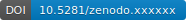

===========================
LabInform ELN documentation
===========================

Welcome! This is the documentation for the LabInform ELN component, the **electronic laboratory notebook (ELN)** that is part of the `LabInform laboratory information and management system <https://www.labinform.de/>`_ (LIMS).

Why yet another open-source ELN? Aren't there enough already? We are pretty certain that the LabInform ELN comes with some :ref:`unique features <sec-features>`, and we look back at already ten years of successful operation, though mostly restricted to a single lab but different people (and installations).

.. important::
    A demo of the LabInform ELN can be accessed online: `<https://eln.labinform.de/>`_
    
    The data contained in this demo will be deleted regularly. Nevertheless, don't enter any sensible data in there, as everybody will be able to access them.

.. _sec-features:

Features
========

System:

* Based on `DokuWiki <https://www.dokuwiki.org/>`_, "a simple to use and highly versatile Open Source wiki software".

* Small footprint: minimum system requirements, simple installation, no database backend

* Flexible, easily adapted to your needs from *within* the Web UI

* Fine-grained access control and role model

* Hierarchical structure, well-suited for knowledge management

* Complete audit trail of changes

Contents:

* Flexible contents including media, thanks to simple yet powerful DokuWiki markup symtax

* Inventory for samples

* Automatic cross-linking between inventory and labbook entries

* new entries via web forms and configurable templates

And to make it even more convenient for users and future-proof:

* Open source project

* Extensive documentation

.. _sec-how_to_cite:

How to cite
===========

The LabInform ELN is free software. However, if you use the LabInform ELN as crucial infrastructure component of your own research, please cite both, the article describing it and the software itself:

* Mirjam Schröder, Till Biskup. LabInform ELN: A lightweight and flexible electronic laboratory notebook for academic research based on the open-source software DokuWiki. To be submitted.

* Till Biskup. Labinform ELN (2022). doi:10.5281/zenodo.#######

To make things easier, the LabInform ELN has a `DOI <https://doi.org/10.5281/zenodo.#######>`_ provided by `Zenodo <https://zenodo.org/>`_, and you may click on the badge below to directly access the record associated with it. Note that this DOI refers to the software as such and always forwards to the most current version.

Where to start
==============

If you want to know what it is all about or are unsure whether the LabInform ELN is interesting for you, start :doc:`right at the beginning <audience>`. If you are a user of the LabInform ELN and look for how to do things, the :doc:`user manual <user/index>` should be the right place. If you want to install the LabInform ELN or are the person with IT competence in carge of keeping it running, have a look at the :doc:`administrator manual <admin/index>`. Finally, if you are interested in contributing to the LabInform ELN, the :doc:`developers corner <developer/index>` is the right place for you.

Installation
============

Generally, DokuWiki requires a running web server and PHP, but no database. Hence, basic familiarity with setting up a web server and with the command line are necessary. The LabInform ELN builds upon a series of plugins for DokuWiki. Detailed installation instructions can be found in the :doc:`administrator manual <admin/index>`.

Related projects
================

There is a number of related packages users of the LabInform ELN may well be interested in, as they have a similar scope, focussing on spectroscopy and reproducible research.

* `ASpecD <https://docs.aspecd.de/>`_

  A Python framework for the analysis of spectroscopic data focussing on reproducibility and good scientific practice.

.. toctree::
   :maxdepth: 2
   :caption: Overview:
   :hidden:

   audience
   introduction
   concepts
   usecases

.. toctree::
   :maxdepth: 2
   :caption: User Manual:
   :hidden:

   user/index

.. toctree::
   :maxdepth: 2
   :caption: Administrator Manual:
   :hidden:

   admin/index
   admin/installing
   admin/organisation
   admin/forms_templates

.. toctree::
   :maxdepth: 2
   :caption: Developers Corner:
   :hidden:

   developer/index
   developer/people
   developer/developers
   developer/changelog
   developer/roadmap

License
=======

This program is free software: you can redistribute it and/or modify it under the terms of the **BSD License**. However, if you use the LabInform ELN as crucial infrastructure component of your own research, please cite it appropriately. See :ref:`How to cite <sec-how_to_cite>` for details.

A note on the logo
==================

The "L" originates from the Computer Modern Roman font originally designed by Donald E. Knuth for his TeX typesetting system. As such, it represents science and the scientific method. Harbouring the "i" representing the information bit puts things right: Proper and reproducible science is the solid support for all the information we can retrieve. The copyright of the logo belongs to J. Popp.
