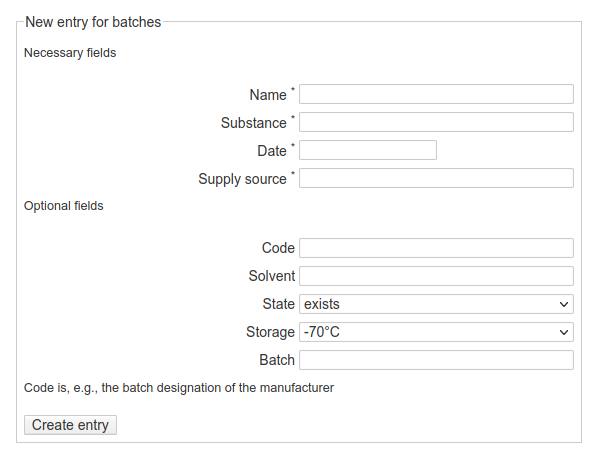

Batches
=======

Create a new batch
------------------

    Web-form for creating a new entry for a batch. While there is a rather small set of required fields, a larger list of optional fields can be filled by the user if applicable. As a rule of thumb, whatever information is (easily) available upon creating a new entry should be entered.

Some comments on the fields of the form:

* difference between obligatory and optional fields
* different types of fields (text, date, select)
* a batch can be derived from another batch

Overview of a batch
-------------------

.. figure:: ../images/batch-overviewpage.png
    :align: center

    Overview page of a newly created batch. Besides an overview of the structured metadata entered via the web-form, two overview tables are automatically created, one with the samples derived from this batch, and one with batches derived from this batch. Any comments and additional information should be added below these tables.

.. important::

    To edit any of the information in the structured metadata block, do not use the edit button on the right margin, as you would do for all the other sections, but rather the edit button directly attached to the metadata block on its lower left. The difference between the two is that with the left one you get a form similar to the one used for entering the metadata in the first place, while the right edit button lets you edit the DokuWiki syntax for this metadata block.

.. todo::

    Replace screenshots of templates with actual overview pages with content.

