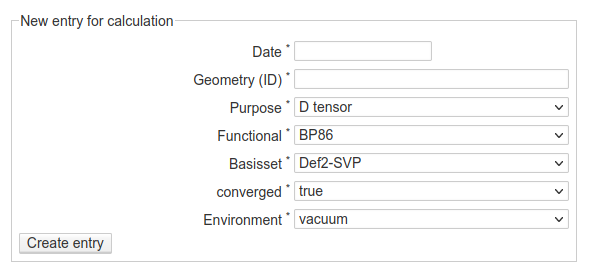

Calculations
============

As described in the :doc:`workflow <./workflow>`, when documenting calculations, each calculation is carried out on an individual geometry that in turn is derived from a molecule. Hence, before creating calculation entries, you will first need to create a molecule and a geometry. This may appear unnecessarily complicated at first, but it tremendously helps with organising your calculations and finding and accessing all relevant information.

Create a new calculation
------------------------

    Web-form for creating a new entry for a calculation. All fields shown are required. Besides date (that can be chosen using a convenient date picker) and the ID of the underlying geometry, all other field values are selected from a list. This controlled vocabulary can be set from the DokuWiki admin interface.

Some comments on the fields of the form:

* ...

