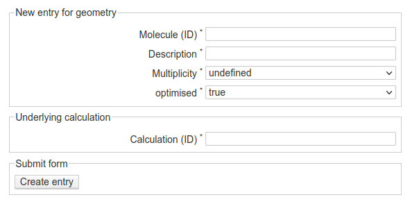

Geometries
==========

As described in the :doc:`workflow <./workflow>`, when documenting calculations, each calculation is carried out on an individual geometry that in turn is derived from a molecule. Hence, before creating calculation entries, you will first need to create a molecule and a geometry. This may appear unnecessarily complicated at first, but it tremendously helps with organising your calculations and finding and accessing all relevant information.

Create a new geometry
---------------------

    Web-form for creating a new entry for a geometry. A geometry is always based on a molecule, hence the molecule ID is the first piece of information to be entered. Additional required fields are a (short) description, the multiplicity and whether the geometry has been optimised. Usually, the latter piece of information will be "false" for the first geometry of a molecule, but as you will want to perform a geometry optimisation on a raw geometry, the result will be a new and optimised geometry of the same molecule. Only in case of the geometry to be optimised will you see the additional required field for entering the ID of the underlying calculation (*i.e.*, geometry optimisation).

Some comments on the fields of the form:

* ...

