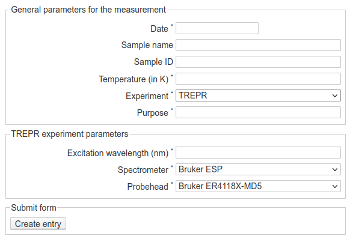
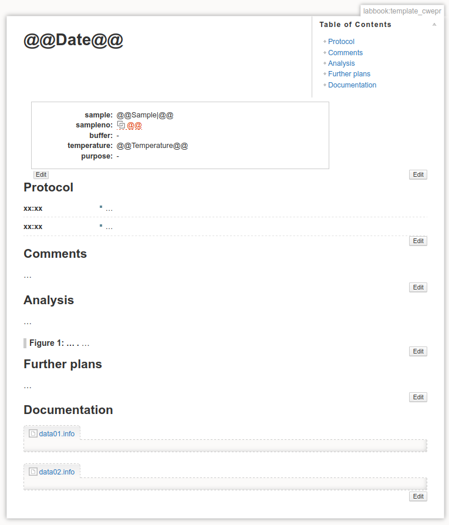

Measurements
============

...

Create a new labbook entry
--------------------------

.. figure:: ../images/measurement-form.png
    :align: center

    Web-form for creating a new labbook entry for an individual measurement. As you can see, the reference to a sample is one of the required fields, and here, you will enter the sample number. Furthermore, depending on the method chosen, (different) additional form fields may show up.

    Web-form for creating a new labbook entry for an individual measurement, but with different type of experiment selected. Depending on the experiment, other additional fields will show up, and different presets for select fields can be set.

Some comments on the fields of the form:

* difference between obligatory and optional fields
* different types of fields (text, date, select)
* a measurement is always performed on a sample
* different experiments can have different sets of additional parameters

A first look at the labbook entry
---------------------------------

    A first glimpse at a newly created labbook entry. Besides an overview of the structured metadata entered via the web-form, this page contains a chronological protocol of what has been done, followed by a series of sections that you can fully adapt to your liking. Here, it is comments, analysis, further plans, and documentation. The latter is used to store an extended set of structured metadata recorded during data acquisition, *e.g.* in the Infofile format.

.. important::

    To edit any of the information in the structured metadata block, do not use the edit button on the right margin, as you would do for all the other sections, but rather the edit button directly attached to the metadata block on its lower left. The difference between the two is that with the left one you get a form similar to the one used for entering the metadata in the first place, while the right edit button lets you edit the DokuWiki syntax for this metadata block.

.. todo::

    Replace screenshots of templates with actual overview pages with content.
