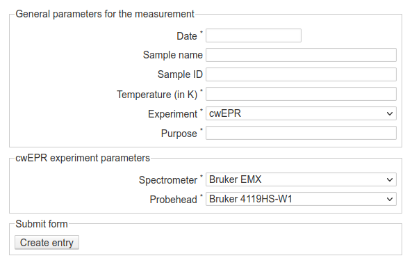

Measurements
============

    Web-form for creating a new labbook entry for an individual measurement. As you can see, the reference to a sample is one of the required fields, and here, you will enter the sample number. Furthermore, depending on the method chosen, additional form fields may show up.
