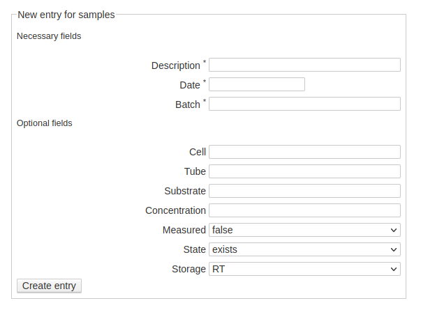

Samples
=======

    Web-form for creating a new entry for a sample. While there is a rather small set of required fields, a larger list of optional fields can be filled by the user if applicable. As a rule of thumb, whatever information is (easily) available upon creating a new entry should be entered.
